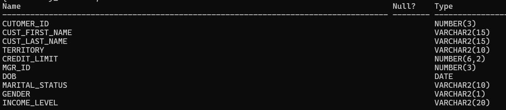
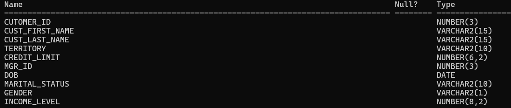
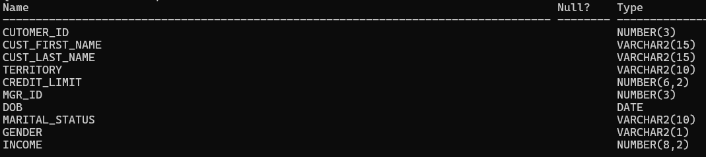

# Customer Table Queries

### Table Creation

```sql
create table my_customers(cutomer_id Number(3), cust_first_name varchar2(15), cust_last_name varchar2(15), Territory varchar2(10), credit_limit Number(6,2), Mgr_id Number(3), DOB date, Marital_Status Varchar(10), Gender varchar2(1), Income_level varchar2(20));
```

### Table Schema

```sql
desc my_customers;
```

Output



### Create table of any name but schema must be same as my customers

```sql
create table c as select * from my_cutomers where 1=2;

desc c;
```

Output


### Rename the table to Customers_2011

```sql
alter table c rename to customers_2011;
```


### Show all tables in your system

```sql
select * from tab;
```

### Change datatype of income_level from varchar2(20) to Number(8,2)

```sql
ALTER TABLE customers_2011 MODIFY income_level NUMBER(8,2);
```


```sql
desc customers_2011;
```

Output



### Change the attribute name income_level to income

```sql
alter table customers_2011 rename column income_level to income;

desc customers_2011;
```



