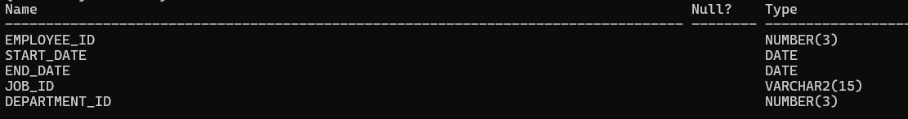
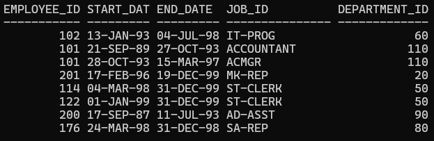
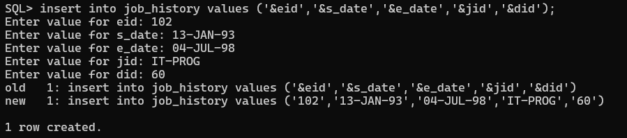
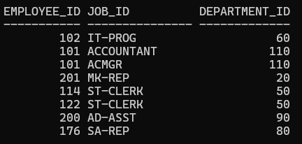
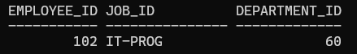
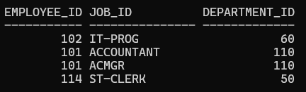
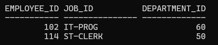
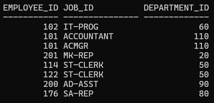
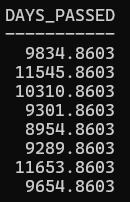

# Table Creation and insert Values


## Table Schema



## Table Data



### Create the following table using SQL query and perform insert, select and describe queries


- Create query
```sql
create table job_history(Employee_ID Number(3), Start_Date date, End_Date date, Job_ID varchar2(15), Department_ID Number(3));
```

Output


- Insert query
```sql
 insert into job_history values ('&eid','&s_date','&e_date','&jid','&did');
```

Output



- Select query
```sql
select * from job_history;
```
Output


### Display Emp_ID, Job_Id, Department_ID for all entries

```sql
select employee_id, job_id, department_id from job_history;
```

Output



### Display the same where emp_id = 102

```sql
select employee_id, job_id, department_id from job_history where employee_id = 102;
```

Output



### Display the same where emp_id < 115

```sql
select employee_id, job_id, department_id from job_history where employee_id < 115;
```

Output



### Display the same where emp_id < 115 and department_id <100

```sql
select employee_id, job_id, department_id from job_history where employee_id < 115 and department_id < 100;
```

Output



### Display the same where emp_id < 115 or department_id <100

```sql
select employee_id, job_id, department_id from job_history where employee_id < 115 or department_id < 100;
```

Output



### For emp_id = 114 make end_date = 30-Nov-2000

```sql
update job_history set end_date='30-NOV-2000' where employee_id = 114;
```

### For department_id = 20 make start_date = 15-Feb-1995

```sql
update job_history set start_date='15-FEB-1995' where department_id = 20;
```

### Find number of days passed after he/she has left the job

```sql
select sysdate-end_date as Days_passed from job_history;
```

Output

