### Note: to get output in shell run the following command

```sql
set serveroutput on;
```
---

## 1) Write a PL/SQL program that takes marks as input and displays grade using if-else ladder

```sql
DECLARE
  marks NUMBER;
  grade VARCHAR2(10);
BEGIN
  marks := &marks;

  IF marks >= 90 THEN
    grade := 'A+';
  ELSIF marks >= 75 THEN
    grade := 'A';
  ELSIF marks >= 60 THEN
    grade := 'B';
  ELSIF marks >= 45 THEN
    grade := 'C';
  ELSE
    grade := 'F';
  END IF;

  DBMS_OUTPUT.PUT_LINE('Grade: ' || grade);
END;
/
```
Output

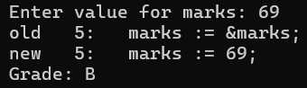

---

## 2) Write a PL/SQL program to display all even numbers up to a number using simple loop

```sql
DECLARE
  i NUMBER := 2;
  n NUMBER := &n;
BEGIN
  LOOP
    EXIT WHEN i > n;
    DBMS_OUTPUT.PUT_LINE(i);
    i := i + 2;
  END LOOP;
END;
/
```

Output

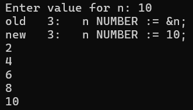

---

## 3) Write a PL/SQL program to find the factorial of a number using For loop

```sql
DECLARE
  n NUMBER := &n;
  fact NUMBER := 1;
BEGIN
  FOR i IN 1..n LOOP
    fact := fact * i;
  END LOOP;
  DBMS_OUTPUT.PUT_LINE('Factorial: ' || fact);
END;
/
```
Output

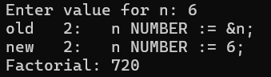

---

## 4) Write a PL/SQL program to display the Fibonacci series up to 20000 using while loop

```sql
DECLARE
  a NUMBER := 0;
  b NUMBER := 1;
  temp NUMBER;
BEGIN
  WHILE a <= 20000 LOOP
    DBMS_OUTPUT.PUT_LINE(a);
    temp := a + b;
    a := b;
    b := temp;
  END LOOP;
END;
/
```

Output

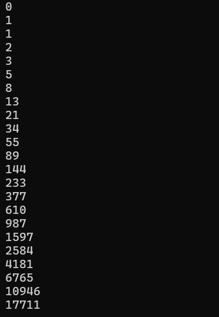

---

## 5) Write a PL/SQL program to insert random numbers in a table `random_num(rand_no number(20))`

```sql
BEGIN
  FOR i IN 1..10 LOOP
    INSERT INTO random_num(rand_no) VALUES (TRUNC(DBMS_RANDOM.VALUE(1, 1000)));
  END LOOP;
  COMMIT;
END;
/
```

Output

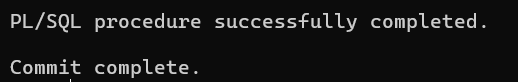

---

## 6) Write a PL/SQL program to fill up the table `sphere(rad number(2), area number(10,2), volume number(15,2))` with radius values from 1-20

```sql
BEGIN
  FOR r IN 1..20 LOOP
    INSERT INTO sphere
    VALUES (
      r,
      4 * 3.1416 * r * r,
      (4 / 3) * 3.1416 * r * r * r
    );
  END LOOP;
  COMMIT;
END;
/
```

Output

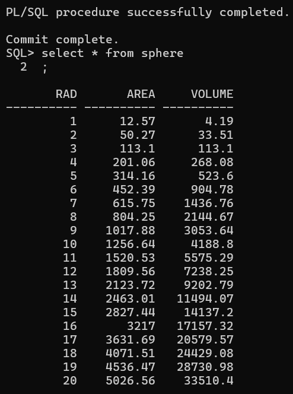

---

## 7) Write a PL/SQL program to display name, age and rating from table `sailor` from user input `s_id`

```sql
DECLARE
  v_name sailor.sname%TYPE;
  v_age sailor.age%TYPE;
  v_rating sailor.rating%TYPE;
  v_id sailor.sid%TYPE := &s_id;
BEGIN
  SELECT sname, age, rating INTO v_name, v_age, v_rating
  FROM sailor
  WHERE sid = v_id;

  DBMS_OUTPUT.PUT_LINE('Name: ' || v_name);
  DBMS_OUTPUT.PUT_LINE('Age: ' || v_age);
  DBMS_OUTPUT.PUT_LINE('Rating: ' || v_rating);
EXCEPTION
  WHEN NO_DATA_FOUND THEN
    DBMS_OUTPUT.PUT_LINE('No sailor found with ID ' || v_id);
END;
/
```

---

## 8) Write a PL/SQL program to display all multiples of 3 up to a number using while loop

```sql
DECLARE
  i NUMBER := 3;
  n NUMBER := &n;
BEGIN
  WHILE i <= n LOOP
    DBMS_OUTPUT.PUT_LINE(i);
    i := i + 3;
  END LOOP;
END;
/
```

Output

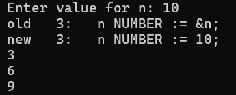

---

## 9) Write a PL/SQL program to display multiples of 5 using for loop

```sql
DECLARE
  n NUMBER := &n;
BEGIN
  FOR i IN 1..n LOOP
    IF MOD(i, 5) = 0 THEN
      DBMS_OUTPUT.PUT_LINE(i);
    END IF;
  END LOOP;
END;
/
```

Output

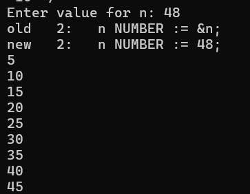

---

## 10) Write a PL/SQL program to calculate the salary from basic pay

```sql
DECLARE
  basic NUMBER := &basic;
  hra NUMBER;
  da NUMBER;
  gross NUMBER;
BEGIN
  hra := basic * 0.2;
  da := basic * 0.1;
  gross := basic + hra + da;

  DBMS_OUTPUT.PUT_LINE('Gross Salary: ' || gross);
END;
/
```

Output

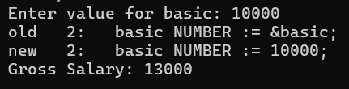

---

## 11) Write a PL/SQL program to STRING REVERSE

```sql
DECLARE
  str VARCHAR2(100) := '&input_string';
  rev VARCHAR2(100) := '';
BEGIN
  FOR i IN REVERSE 1..LENGTH(str) LOOP
    rev := rev || SUBSTR(str, i, 1);
  END LOOP;
  DBMS_OUTPUT.PUT_LINE('Reversed String: ' || rev);
END;
/
```

Output

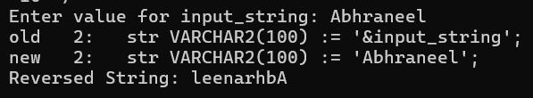

---

## 12) Write a PL/SQL program to find LEAP YEAR

```sql
DECLARE
  year NUMBER := &year;
BEGIN
  IF MOD(year, 400) = 0 THEN
    DBMS_OUTPUT.PUT_LINE(year || ' is a Leap Year');
  ELSIF MOD(year, 100) = 0 THEN
    DBMS_OUTPUT.PUT_LINE(year || ' is NOT a Leap Year');
  ELSIF MOD(year, 4) = 0 THEN
    DBMS_OUTPUT.PUT_LINE(year || ' is a Leap Year');
  ELSE
    DBMS_OUTPUT.PUT_LINE(year || ' is NOT a Leap Year');
  END IF;
END;
/
```

Output

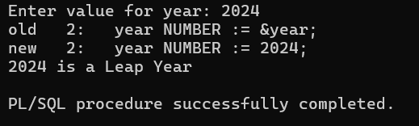

---

