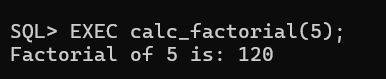
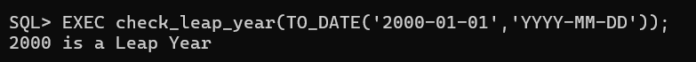
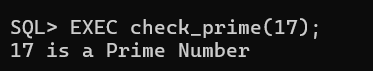
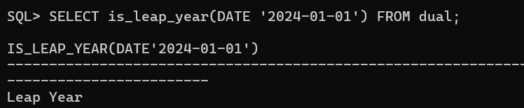
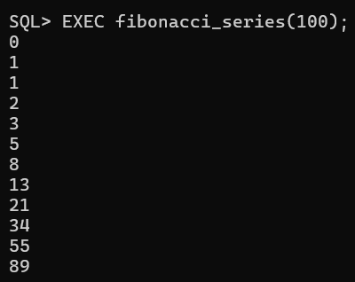
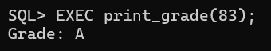
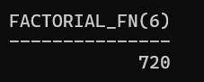
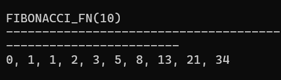

---

## 1) Create a PL/SQL procedure to calculate factorial of a number

```sql
CREATE OR REPLACE PROCEDURE calc_factorial(n IN NUMBER) IS
  fact NUMBER := 1;
BEGIN
  FOR i IN 1..n LOOP
    fact := fact * i;
  END LOOP;
  DBMS_OUTPUT.PUT_LINE('Factorial: ' || fact);
END;
/
```

**Usage:**

```sql
EXEC calc_factorial(5);
```

Output



---

## 2) Create a PL/SQL procedure that takes a user-input date and then prints if the year is a leap year

```sql
CREATE OR REPLACE PROCEDURE check_leap_year(p_date IN DATE) IS
  y NUMBER := TO_NUMBER(TO_CHAR(p_date, 'YYYY'));
BEGIN
  IF MOD(y, 400) = 0 OR (MOD(y, 4) = 0 AND MOD(y, 100) != 0) THEN
    DBMS_OUTPUT.PUT_LINE(y || ' is a Leap Year');
  ELSE
    DBMS_OUTPUT.PUT_LINE(y || ' is NOT a Leap Year');
  END IF;
END;
/
```

**Usage:**

```sql
EXEC check_leap_year(TO_DATE('2000-01-01','YYYY-MM-DD'));
```

Output



---

## 3) Create a PL/SQL procedure to find prime number

```sql
CREATE OR REPLACE PROCEDURE check_prime(n IN NUMBER) IS
  flag BOOLEAN := TRUE;
BEGIN
  IF n < 2 THEN
    flag := FALSE;
  ELSE
    FOR i IN 2..TRUNC(SQRT(n)) LOOP
      IF MOD(n, i) = 0 THEN
        flag := FALSE;
        EXIT;
      END IF;
    END LOOP;
  END IF;

  IF flag THEN
    DBMS_OUTPUT.PUT_LINE(n || ' is a Prime Number');
  ELSE
    DBMS_OUTPUT.PUT_LINE(n || ' is NOT a Prime Number');
  END IF;
END;
/
```

**Usage:**

```sql
EXEC check_prime(17);
```

---

## 4) Create a PL/SQL procedure to STRING REVERSE

```sql
CREATE OR REPLACE PROCEDURE reverse_string(input_str IN VARCHAR2) IS
  rev VARCHAR2(100) := '';
BEGIN
  FOR i IN REVERSE 1..LENGTH(input_str) LOOP
    rev := rev || SUBSTR(input_str, i, 1);
  END LOOP;
  DBMS_OUTPUT.PUT_LINE('Reversed String: ' || rev);
END;
/
```

**Usage:**

```sql
EXEC reverse_string('Oracle');
```

Output



---

## 5) Create a PL/SQL function that takes a user-input date and returns if the year is a leap year

```sql
CREATE OR REPLACE FUNCTION is_leap_year(p_date IN DATE) RETURN VARCHAR2 IS
  y NUMBER := TO_NUMBER(TO_CHAR(p_date, 'YYYY'));
BEGIN
  IF MOD(y, 400) = 0 OR (MOD(y, 4) = 0 AND MOD(y, 100) != 0) THEN
    RETURN 'Leap Year';
  ELSE
    RETURN 'Not a Leap Year';
  END IF;
END;
/
```

**Usage:**

```sql
SELECT is_leap_year(DATE '2024-01-01') FROM dual;
```

Output



---

## 6) Create a PL/SQL procedure to implement Fibonacci series

```sql
CREATE OR REPLACE PROCEDURE fibonacci_series(limit_val IN NUMBER) IS
  a NUMBER := 0;
  b NUMBER := 1;
  temp NUMBER;
BEGIN
  WHILE a <= limit_val LOOP
    DBMS_OUTPUT.PUT_LINE(a);
    temp := a + b;
    a := b;
    b := temp;
  END LOOP;
END;
/
```

**Usage:**

```sql
EXEC fibonacci_series(100);
```

Output



---

## 7) Write a PL/SQL procedure that takes marks as input and prints the corresponding grade

```sql
CREATE OR REPLACE PROCEDURE print_grade(marks IN NUMBER) IS
  grade VARCHAR2(10);
BEGIN
  IF marks >= 90 THEN
    grade := 'A+';
  ELSIF marks >= 75 THEN
    grade := 'A';
  ELSIF marks >= 60 THEN
    grade := 'B';
  ELSIF marks >= 45 THEN
    grade := 'C';
  ELSE
    grade := 'F';
  END IF;
  DBMS_OUTPUT.PUT_LINE('Grade: ' || grade);
END;
/
```

**Usage:**

```sql
EXEC print_grade(83);
```

Output



---

## 8) Create a PL/SQL function to calculate factorial of a number

```sql
CREATE OR REPLACE FUNCTION factorial_fn(n IN NUMBER) RETURN NUMBER IS
  fact NUMBER := 1;
BEGIN
  FOR i IN 1..n LOOP
    fact := fact * i;
  END LOOP;
  RETURN fact;
END;
/
```

**Usage:**

```sql
SELECT factorial_fn(6) FROM dual;
```

Output



---

## 9) Create a PL/SQL function to implement Fibonacci series

```sql
CREATE OR REPLACE FUNCTION fibonacci_fn(n IN NUMBER) RETURN VARCHAR2 IS
  a NUMBER := 0;
  b NUMBER := 1;
  fib VARCHAR2(1000) := '0';
  temp NUMBER;
BEGIN
  FOR i IN 2..n LOOP
    temp := a + b;
    fib := fib || ', ' || b;
    a := b;
    b := temp;
  END LOOP;
  RETURN fib;
END;
/
```

**Usage:**

```sql
SELECT fibonacci_fn(10) FROM dual;
```

Output



---

